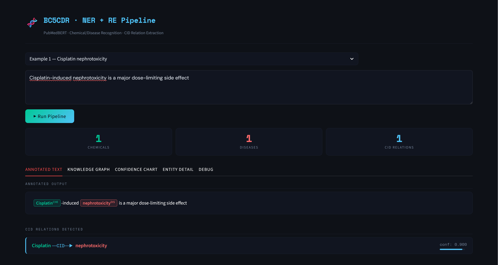
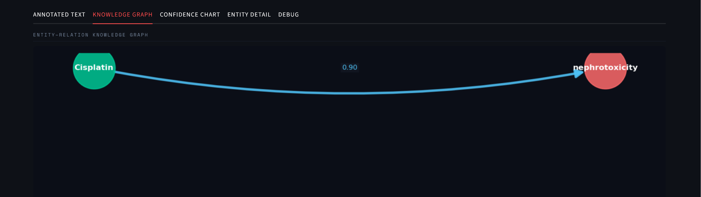

# Biomedical_NER_and_Relation_Extraction

A biomedical NLP pipeline built using PubMedBERT for Chemical/Disease Named Entity Recognition (NER) and Chemical–Disease Relation Extraction on the BC5CDR dataset.

## Features

- Chemical and Disease entity recognition
- CID relation extraction
- Interactive knowledge graph visualization
- Confidence scoring and annotated outputs
- Streamlit-based dashboard

## Tech Stack
<p>
  
  
  
  
  
  
</p>

## Dataset

- BC5CDR (BioCreative V Chemical Disease Relation Dataset)
- 95,000+ labeled biomedical tokens
- 
## Interface



## Example

### Input

```text
Cisplatin-induced nephrotoxicity is a major dose-limiting side effect.
```

### Output

- Chemical: Cisplatin
- Disease: nephrotoxicity
- Relation: Cisplatin → CID → nephrotoxicity

## Author

Nikita Maurya
